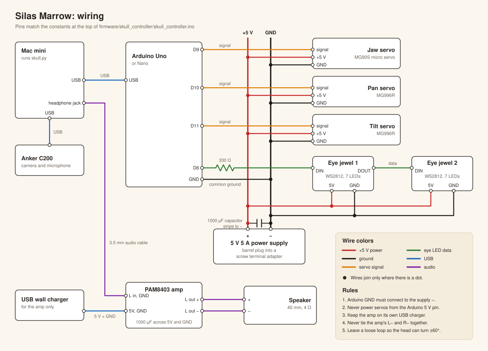

# Silas Marrow: the talking skull of the Elephant Corral

A life-size skull by the office door that turns to look at people, roasts their outfit in a raspy Old West voice, and talks back when they answer. The character is the (fictional) ghost of a faro dealer who has haunted the Elephant Corral at 1444 Wazee St since 1859. The history it uses is real, pulled from the building's historical markers.

```
 Anker C200 (in the base)
      │  video + mic
      ▼
 Mac mini ── skull.py ─────────────────────────────────────────────┐
   • YOLO pose tracking: where is the nearest face?                │
   • Claude (Haiku 4.5): look at the frame, write a line            │
   • ElevenLabs Flash TTS: speak it; audio level drives the jaw     │
   • ElevenLabs Scribe STT: hear the reply, keep the conversation   │
   • Phone control page on port 8090                                │
      │ headphone jack                 │ USB serial                  │
      ▼                                ▼                             │
 PAM8403 amp ─► 40 mm speaker     Arduino Uno ─► jaw servo (MG90S)    │
 (under the jaw)                               ─► pan servo (MG996R)  │
                                               ─► tilt servo (MG996R) │
                                               ─► 2 x WS2812 eye jewels
```

## Folder map

| Path | What it is |
|---|---|
| `software/skull.py` | Main program: vision, behavior, web control page |
| `software/brain.py` | Claude prompts (greeting, conversation) |
| `software/voice.py` | ElevenLabs speech out with jaw sync, speech in |
| `software/vision.py` | Camera thread, YOLO pose tracking, gaze math |
| `software/hardware.py` | Serial link to the Arduino |
| `software/virtual.py` | Software twin of the Arduino sketch, for the on-screen skull |
| `software/web/` | The on-screen 3D skull (three.js) |
| `software/calibrate.py` | Servo, eye, mic and voice test tools |
| `software/persona.md` | Silas's character, history and rules. Edit freely. |
| `software/config.json` | All the tuning knobs |
| `firmware/skull_controller/` | Arduino sketch |
| `cad/skull_parts.scad` | Parametric source for every printed part |
| `cad/stl/` | Ready-to-print STLs (default measurements) |
| `cad/previews/` | Renders of the assembly and parts |
| `docs/parts.md` | Full parts list with quantities and specs |
| `docs/wiring.svg` | Wiring diagram |
| `docs/assembly.md` | Step-by-step assembly guide with a screw table |

## 1. Parts

The full list with quantities and specs is in [docs/parts.md](docs/parts.md). In short:

**Already in your cart:** Evotech skull, Hosyond MG996R 4-pack, Miuzei MG90S 4-pack, HiLetgo PAM8403 amp (with knob), Gikfun 40 mm 4Ω speakers, capacitor kit, lazy susan bearings, servo extension cables, ALITOVE 5V 5A supply, WS2812 7-LED jewels, speaker grille cloth.

**You have:** Mac mini, Anker PowerConf C200, Arduino Uno (a Nano works too), 3D printer.

**Small hardware to scrounge or grab at the hardware store:**

- M3 screws, 8 to 16 mm, about 30 (they self-tap into the printed pilot holes)
- One M5 x 50 mm bolt, nylon lock nut and 2 washers (idle tilt pivot)
- 1.5 mm steel wire for the jaw pushrod (music wire, or a big paperclip)
- 5-minute epoxy or E6000 (jaw tab, eye holders)
- Double-sided foam tape, small zip ties, hookup wire
- One 330Ω resistor (eye data line)
- A 5V USB wall charger and a spare USB cable to cut up (amp power)
- A 3.5 mm audio cable to cut up (Mac headphone jack to amp)

## 2. Printing

Default measurements match the parts you ordered. **Before printing, measure your actual parts** and edit the values marked `(M)` at the top of `cad/skull_parts.scad`. Then re-export with:

```bash
brew install --cask openscad@snapshot    # the stable cask is disabled in Homebrew
openscad -D 'part="turntable"' -o stl/turntable.stl skull_parts.scad
```

| Part | Qty | Material | Orientation / supports | Notes |
|---|---|---|---|---|
| `base_shell` | 1 | PLA, 3 walls, 15% infill | Top face on the bed (the STL is already flipped). No supports. | About 12 hr. Needs a 150 mm square bed area. |
| `base_floor` | 1 | PLA | Flat | Arduino standoffs, amp pad, camera cradle screws |
| `camera_cradle` | 1 | PLA | As exported, **supports on** under the shelf | Check `cam_w/h/d` against your Anker first |
| `grille_frame` | 1 | PLA, black | Lip on the bed | Clamps the grille cloth in the camera window |
| `turntable` | 1 | PETG preferred, 40% infill | Disc on the bed | Carries the whole head. Check `ls_size`, `ls_hole`. |
| `horn_column` | 1 | PETG | Standing up | Couples the pan servo horn to the turntable. Flat sides leave room for the wires. |
| `cradle` | 1 | PETG, 40% infill | Platform on the bed (already flipped) | The skull sits on this. Jaw servo mounts to it. |
| `pivot_spacer` | 1 | Any | Standing up | Goes on the M5 bolt |
| `speaker_holder` | 1 | PLA | Ring on the bed | |
| `jaw_tab` | 2 | PLA | Flat | One spare |
| `eye_holder` | 2 | PLA, black | Flat | |
| `eye_diffuser` | 2 | White or translucent PLA/PETG, 2 perimeters | Dome up | Frosts the LEDs into a glow |
| `pvc_socket` | 1 | PLA | Flange on the bed | Optional: mounts the base on a 2" PVC pipe column |

## 3. Wiring



The same connections as text:

```
                   ALITOVE 5V 5A ── screw adapter ──┬── + servo power rail
                                                    └── − servo power rail ─┐
  1000µF cap across + and − right at the rail (stripe to −)                 │
                                                                            │
  Arduino Uno                                                               │
    D9  ── jaw servo signal (orange)       servo red  ── + rail             │
    D10 ── pan servo signal                servo brown ── − rail            │
    D11 ── tilt servo signal                                                │
    D6  ──[330Ω]── eye jewel #1 DIN;  jewel #1 DOUT ── jewel #2 DIN          │
               jewels 5V ── + rail;  jewels GND ── − rail                   │
    GND ───────────────────────────────────────────────────────────────────┘
    USB ── Mac mini (data + Arduino power)

  Audio:  Mac mini headphone jack ── 3.5 mm cable ── PAM8403 L-in + GND
          PAM8403 L-out +/− ── 40 mm speaker     (never tie L− and R− together)
          PAM8403 5V/GND ── separate USB wall charger (keeps servo noise out)
          Put a 1000µF cap across the amp's 5V/GND pads.
```

Rules that prevent 90% of problems:

- **Common ground.** Arduino GND must connect to the servo supply's −. Otherwise the servos twitch randomly.
- **Never power servos from the Arduino's 5V pin.** The ALITOVE powers servos and eyes.
- **Keep the amp on its own USB charger.** Sharing the servo supply puts buzz in the voice.
- Run the skull's wires (jaw servo, eyes, speaker) down through the foramen magnum (the big hole in the skull base), through the cradle's center hole, the turntable's two cable openings beside the horn column, the lazy susan, and into the base. Leave a loose loop so the head can turn ±60°.

## 4. Assembly

The full guide, with a screw table, pictures and a bench test to do first, is in
[docs/assembly.md](docs/assembly.md). The short version:

**Skull prep**

1. Lift off the skull cap (it's held with magnets and pegs, so pull straight up).
2. Unhook the jaw spring. The servo drives the jaw now. If the jaw flops too freely, a much lighter rubber band can take the spring's place later.
3. Epoxy the `jaw_tab` to the inside of the chin, centered, with the ear pointing back toward the throat.
4. Press each LED jewel into an `eye_holder`, clip a `eye_diffuser` on the front, and epoxy the holders inside the eye sockets from within the cranium. Chain the jewels (DOUT of the first to DIN of the second) and route the three wires down through the foramen magnum.
5. Weather the skull if you like: raw umber acrylic, brushed on and wiped off, leaves "old bone" in the cracks.

**Neck**

6. Trim two opposite sides off the pan servo's round disc horn so it is 17 mm wide, the same as the flat-sided `horn_column`. Screw the horn to the bottom of the column with the flats lined up (radial slots fit most horns), then screw the column under the `turntable` with four countersunk M3s. The wires from the head pass down beside those flats.
7. Screw the lazy susan's top plate to the turntable, and its bottom plate to the top of the `base_shell` (the diagonal slots fit most hole patterns).
8. Hang the pan servo under the base top: shaft up into the horn, tabs screwed to the two bridges. Before pressing it onto the horn, center the servo (`python calibrate.py servos`, pick 1, press c) with the head facing forward.
9. Mount the tilt servo in the +X upright with its body outside and the spline poking through.
10. Mount the MG90S jaw servo in the cradle's front plate, and the speaker in the `speaker_holder`, screwed to the cradle's front edge.
11. Screw the `cradle` to the skull base with M3s through the long slots. **Don't tighten yet.**
12. Hang the cradle in the yoke: servo horn screwed to the +X arm, M5 bolt through the −X upright, spacer and arm.
13. **Balance.** With the tilt servo relaxed (`X` command or unplugged), slide the skull forward or back in the slots until it barely tips either way. Then tighten. A balanced head is what lets the MG996R hold it steadily all day.
14. Bend a Z in one end of the 1.5 mm wire, hook it in the jaw tab, and connect the other end to the jaw servo horn. With the servo at closed, size the wire so the jaw is just shut.

**Base**

15. Screw the Arduino to the standoffs on the `base_floor`, stick the amp on its pad with foam tape, and screw the `camera_cradle` in behind the window.
16. Strap the Anker into the cradle with zip ties. Its lens should sit right against the window.
17. Stretch grille cloth over the window and press the `grille_frame` in from outside to clamp it tight.
18. Screw the floor to the shell. Optional: bolt on the `pvc_socket` and stand the whole thing on a 2" PVC pipe so the skull is at eye level.

## 5. Mac mini setup

```bash
brew install python@3.12 ffmpeg
cd talking-skull/software
python3.12 -m venv .venv && source .venv/bin/activate
pip install -r requirements.txt
cp .env.example .env        # paste your Anthropic and ElevenLabs keys in
```

**Voice.** `config.json` uses **Jessie, Vintage Narrator** (`KgUSWQPFmuiZ5ycRbnty`), a raspy Wild West old-timer from the ElevenLabs voice library. Library voices need to be added to your account before the API can use them: in ElevenLabs, open Voice Library, search "Jessie Vintage Narrator", and click Add to my voices. Two other good fits:

- `uVKHymY7OYMd6OailpG5`: Frederick, Old Gnarly Narrator (deep, grizzled)
- `1BfrkuYXmEwp8AWqSLWk`: Declan Graves (creepier, slight Irish rasp)

**Devices.**

```bash
python skull.py --list-cameras     # set camera.index
python skull.py --list-audio       # set voice.output_device and ears.input_device (name fragments)
ls /dev/cu.usbmodem*               # set hardware.serial_port
```

Give Terminal camera and microphone access when macOS asks (System Settings > Privacy & Security).

**Firmware.** In the Arduino IDE, install **Adafruit NeoPixel** from the Library Manager, open `firmware/skull_controller/skull_controller.ino`, and upload to the Uno.

## 6. Calibration

1. **Servo limits.** Take the skull off first. Run `python calibrate.py servos`. For each servo, find the pulse for jaw closed and open, pan center and a comfortable left limit, and tilt level and a comfortable up limit. Put the numbers in the calibration block at the top of the sketch and upload again. Flip the sign of `PAN_SPAN_US` or `TILT_SPAN_US` if an axis runs backwards.
2. **Eyes.** `python calibrate.py eyes` cycles colors and modes. Pick a color on the phone page later.
3. **Voice and jaw.** `python calibrate.py say "Howdy, pilgrim."`. If the jaw flaps at silence, raise `jaw_floor_db`. If it barely moves, lower `jaw_ceiling_db`. If it runs ahead of or behind the audio, adjust `jaw_delay_s` by ±0.05.
4. **Mic.** `python calibrate.py mic`. Talk from where people stand and set `ears.speech_min_rms` a bit above the room-noise reading.
5. **Gaze.** `python skull.py --show`, stand in front, and move around. If the head aims low (the camera sits below the eyes), raise `gaze.tilt_offset_deg`. If it turns the wrong way, set `invert_pan` or `invert_tilt`. If it under- or over-turns, adjust `pan_range_deg` and `tilt_range_deg` to match the angles your servo spans reach.

## 7. Running it

```bash
python skull.py --show --no-skull    # first test: camera + Claude + voice, no Arduino
python skull.py --show               # everything, with a preview window
python skull.py                      # headless; use the phone page
```

Open `http://<mac-mini-name>.local:8090` on your phone. The page has:

- a live camera view
- **Arm** (it starts disarmed) and **Conversation** toggles
- **Greet now**, **Stop talking**, **Center head** and **Relax servos** buttons
- a **Say** box, so you can puppet Silas live
- volume and eye color controls
- a log of everything it said and heard

Set `web.token` to require `?t=yourtoken` on the URL.

### Virtual skull

No hardware on the desk? Silas can live on the screen instead:

```bash
python skull.py --virtual                        # everything, with an on-screen skull
python skull.py --virtual --no-voice --no-ai     # no API keys needed
```

`--virtual` replaces the Arduino with a 3D skull in its own window. Everything else is
the real thing: it watches through this computer's camera, listens on its microphone,
talks through its speakers, and greets and converses by the same rules. Arm it from the
control page as usual.

- **Devices.** With `--virtual`, the `camera`, `ears`, `voice` and `gaze` values inside
  the `virtual` section of `config.json` replace the main ones. `null` for a device means
  the system default, which is normally the built-in microphone and speakers. The Mac
  mini settings are left alone. Run `--list-cameras` if camera 0 is not the built-in one
  (an iPhone nearby can take that slot).
- **Permissions.** macOS asks for Camera and Microphone access for the terminal you
  run it from.
- **Window.** It opens in Google Chrome's app mode if Chrome is installed, otherwise in
  your default browser. Set `virtual.open_window` to `false` to open it yourself at
  `http://localhost:8090/skull`. Keys: **F** full screen, **C** camera picture,
  **H** hide the text.
- **Gaze.** A webcam sits above the screen, not under the skull. If Silas looks over your
  head or at your chest, change `virtual.gaze.tilt_offset_deg`. If he turns the wrong way
  (a mirrored camera), set `virtual.invert_pan`.
- **Same behavior as the hardware.** The on-screen skull obeys the same commands as the
  Arduino, with the same head smoothing, jaw timeout and eye modes. It also runs next to
  the real skull: open `/skull` on any device to watch a live twin.
- **Without a voice** (`--no-voice`) the jaw still moves for each line, so you can see
  him talk.
- **A better looking skull.** The built-in skull is generated by code and is stylized.
  To use a sculpted one, save it as `software/web/skull.glb` with these named parts:
  `cranium`, `jaw` (its origin on the jaw hinge), and empties `eye_L` and `eye_R` in the
  sockets. Face it toward +Z with Y up, with the jaw's local X axis along the hinge
  (in Blender: face it toward -Y, leave the jaw unrotated, and export glTF with +Y up).
  Any size works. Restart `skull.py` after adding the file.

**How it behaves.** When an armed skull sees a face close enough (`min_height_frac`) for `present_s`, it greets that person once, waits at least `min_gap_s` between greetings, and won't re-greet the same tracked person for 15 minutes. With conversation on, it listens for up to 5 seconds after each line and keeps talking for up to 4 turns, or until the person walks away. It only runs during `active_hours` (7am to 7pm by default), and `ambient_every_min` can make it mutter to itself when the hall is empty (off by default).

**Keep it running.** Use `caffeinate -dimsu &`, or a launchd job like the one in the spider README.

**Costs (rough).** A greeting sends one downscaled frame plus the persona to Claude Haiku 4.5: about 2,000 input tokens, so a fraction of a cent. 100 greetings a day is around $0.25. ElevenLabs is the bigger cost. Each line is about 100 to 150 characters, and Flash models bill around half a credit per character, so check that your plan's monthly credits cover a busy month. `max_greetings_per_hour` is your cost cap.

## 8. Make it yours

- **Personality and history:** edit `software/persona.md`. It is plain text, and the program re-reads it on start.
- **Smarter replies:** set `claude.model` to `claude-sonnet-5`. It's a bit slower and costs more.
- **More expressive voice:** set `voice.tts_model` to `eleven_v3` and `claude.allow_audio_tags` to `true`. Silas can then `[chuckles]` and `[whispers]`, at the cost of more latency.

## 9. Privacy and etiquette

Camera frames are sent to Anthropic's API only at the moment of a greeting. Speech is sent to ElevenLabs only while the skull is listening. Nothing is saved to disk. The persona forbids comments on bodies, age, race and the like, and it has to admit it's an AI if someone sincerely asks. It's still worth putting a small sign by the door ("This skull sees and hears you. It's AI. It's Halloween.") and giving coworkers an easy way to opt out: the Disarm button.

## 10. Troubleshooting

| Symptom | Fix |
|---|---|
| Servos twitch or the Arduino resets | Common ground missing, supply too weak, or the 1000µF cap is missing |
| Head drifts to center on its own | The Mac stopped sending (watchdog). Check the serial port. |
| Jaw doesn't move while talking | `jaw_floor_db` is too high, or the pushrod is binding. Test with `calibrate.py say`. |
| Voice buzzes or hums | Amp on its own USB charger. Add the cap. Try a ground loop isolator. |
| `ElevenLabs TTS 401/403` | The key is wrong, or the voice isn't added to your account |
| PCM refused | The code falls back to MP3 automatically (needs `brew install ffmpeg`) |
| It greets the same person over and over | Raise `regreet_same_person_after_s` and `min_gap_s` |
| It never greets | Check that it's armed, inside active hours, and that `min_height_frac` isn't too high for your hallway |
| Virtual skull page says "offline" | `skull.py` is not running, or the `?t=` token is missing from the URL |
| Virtual skull hears nothing | Microphone access for the terminal, and `virtual.ears.input_device` (`null` = system default) |
