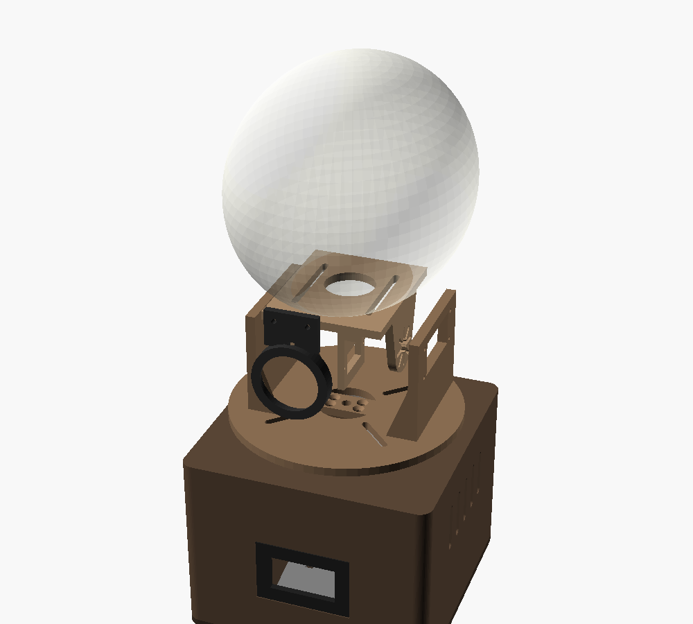
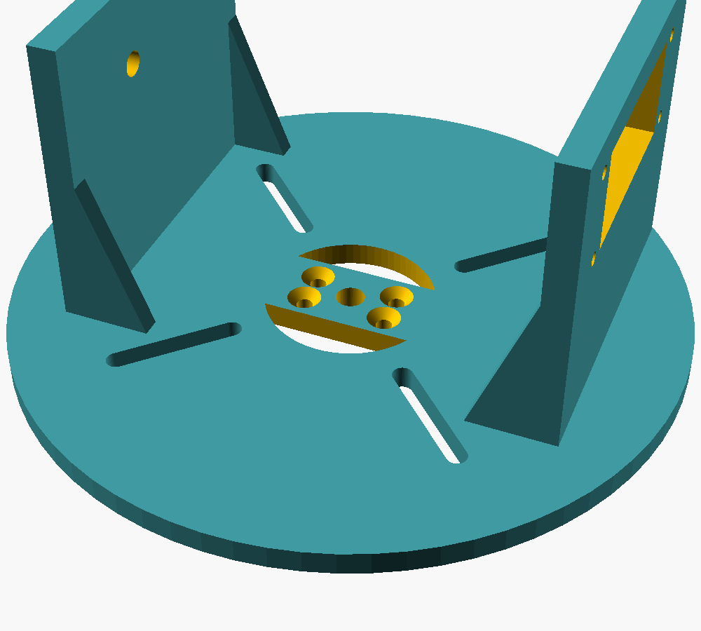
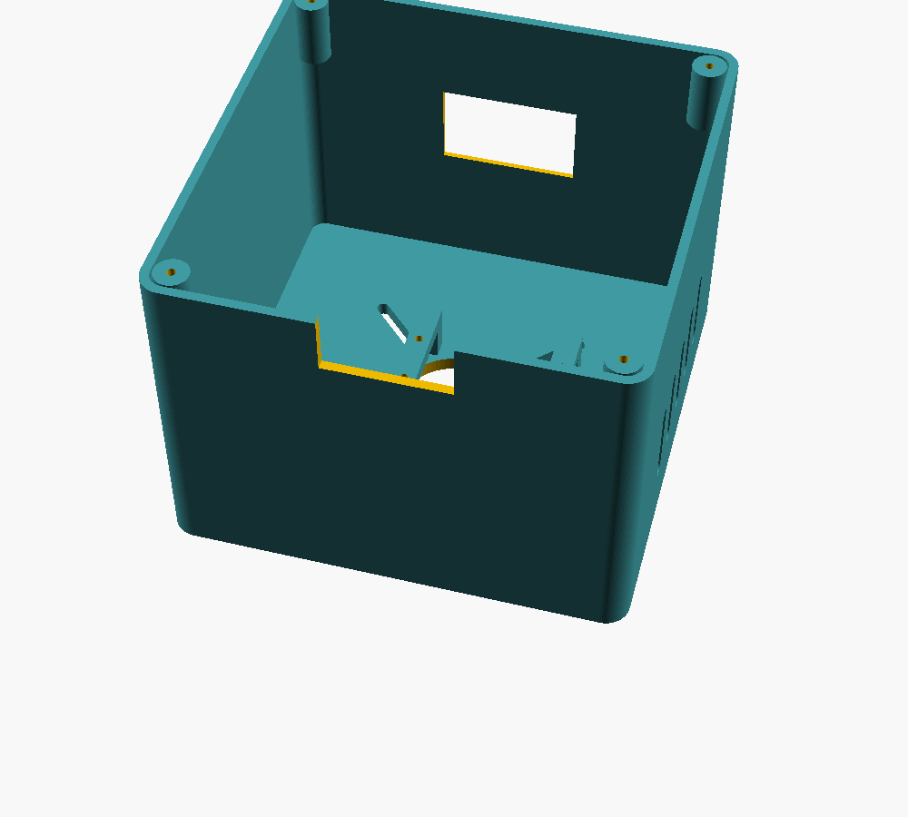
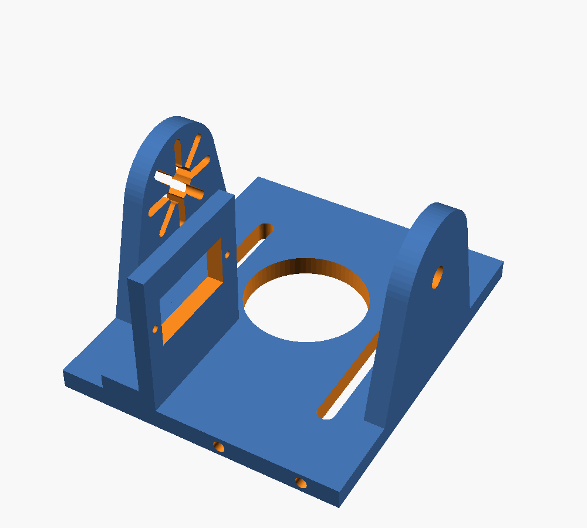
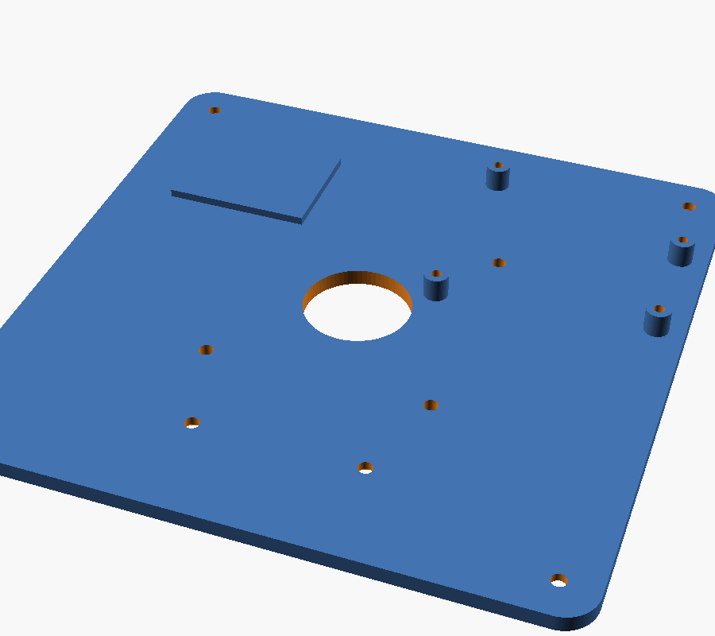

# Assembly guide

How to put the physical skull together, from a pile of parts to a talking head.
Allow an afternoon once everything is printed.

- Parts and quantities: [parts.md](parts.md)
- Wiring: [wiring.svg](wiring.svg)
- Print settings, calibration and troubleshooting: [README](../README.md)

The steps follow the README. The screw sizes, hole counts and clearances were worked out
from the hole sizes in `cad/skull_parts.scad`. Nothing here has been checked against a
finished build yet, so read [Open questions](#open-questions) before you start.

If you printed the `turntable` or `horn_column` before the cable path was fixed, print
them again. The old ones have round cable holes and a fully round column, and the
wires cannot get through.

## Words used in this guide

| Word | Meaning |
|---|---|
| Front | The side of the base with the camera window. It faces the visitors. |
| Right upright | The turntable upright with the rectangular servo cutout. It is on your right when you face the front. The CAD calls it +X. |
| Left upright | The turntable upright with the single round bolt hole. The CAD calls it -X. |
| Horn | The plastic disc or arm that pushes onto a servo's output shaft. |

## Screws

All M3 screws self-tap into printed pilot holes. Drive them slowly and stop when they
are snug. A stripped hole in plastic does not recover.

| Where | Qty | Screw | Notes |
|---|---|---|---|
| Arduino to floor standoffs | 4 | M3 x 8 | |
| Camera cradle to floor | 2 | M3 x 10 or 12, countersunk | From under the floor |
| Pan servo to base bridges | 4 | M3 x 8 | Up through the servo tabs |
| Horn column to turntable | 4 | M3 x 12, countersunk | Down from the top of the turntable |
| Tilt servo to right upright | 4 | M3 x 8 | Through the servo tabs |
| Speaker holder to cradle | 2 | M3 x 10 or 12 | Into the cradle's front edge |
| Cradle to skull | 2 | M3 x 12 to 16, with washers | Through the long slots |
| Floor to shell | 4 | M3 x 12 to 16, countersunk | Into the corner posts |
| PVC socket to floor, optional | 4 | M3 x 10 or 12 | Plus one through the side hole to pin the pipe |
| Jaw servo to cradle | 2 | The small screws supplied with the MG90S | |
| Tilt pivot | 1 | M5 x 50 bolt, 2 washers, nylon lock nut | |

That is 26 M3 screws, or 31 with the PVC socket.

## Stage 1: test everything on the bench

Do this before any part is mounted. A servo that is centered now saves taking the neck
apart later.

1. Upload the firmware to the Arduino. The README covers this in section 5.
2. Wire the three servos, the two eye jewels and the power supply on the bench,
   following the [wiring diagram](wiring.svg). Leave the horns off the servos.
3. Run `python calibrate.py servos` from the `software` folder.
4. For each servo, pick it with `0`, `1` or `2` and press `c` to center it.
5. Mark the pan and tilt servo shafts with a dot of paint so you can see the center
   position later.
6. Run `python calibrate.py eyes` and check that both jewels light.
7. Wire the amp and speaker, then run `python calibrate.py say "Howdy."` and check for
   sound.
8. Unplug everything. Keep the servos at their centered positions.

## Stage 2: prepare the skull

1. Lift off the skull cap. It is held by magnets and pegs, so pull straight up.
2. Unhook the jaw spring. The servo drives the jaw now. If the jaw later flops too
   freely, fit a much lighter rubber band in the spring's place.
3. Epoxy one `jaw_tab` to the inside of the chin. Center it, with the upright fin
   pointing back toward the throat. The grooved face is the glue face.
4. Press each LED jewel into an `eye_holder`, with the wires leaving through the slot in
   the back.
5. Clip an `eye_diffuser` onto the front of each holder.
6. Chain the jewels: the first jewel's DOUT goes to the second jewel's DIN. Join the 5V
   pads together and the GND pads together.
7. Epoxy the holders inside the eye sockets, working from inside the cranium.
8. Route the three eye wires down through the large hole in the skull base.
9. Optional: brush raw umber acrylic onto the skull and wipe it off. It leaves old bone
   color in the cracks.

Let the epoxy cure fully before hanging any weight on the jaw tab.

## Stage 3: build the neck

The `horn_column` has two flat sides. The wires from the head run down past those
flats, so nothing may stick out beyond them.

1. Trim two opposite sides off the pan servo's round disc horn until it is 17 mm wide,
   the same as the column. The horn is 20.5 mm across, so that is a little under 2 mm
   off each side. Side cutters and a file will do it. An untrimmed horn blocks
   the wires.
2. Screw the horn to the bottom of the column, with its trimmed sides in line with the
   flats. The bottom is the end with the slots and the wide recess. The two slots that
   run along the column are full length. The four diagonal ones are short.
3. Set the column under the center of the `turntable`, flats in line with the two
   curved openings, and fix it with four countersunk M3 screws from above.
4. Fasten the lazy susan's top plate to the underside of the turntable, through the
   diagonal slots.
5. Fasten the lazy susan's bottom plate to the top of the `base_shell`, through its
   diagonal slots. The column drops through the center opening.
6. Spin the turntable by hand. It must turn freely with no rubbing on the column.
7. Look down through each curved opening. You should see straight into the base.

Steps 4 and 5 need fasteners that the README does not list. See
[Open questions](#open-questions).

### Fit the pan servo

8. Turn the shell upside down. The two bars near the center are the servo bridges.
9. Check that the pan servo is still centered and that the turntable uprights sit
   square to the front of the base.
10. Lower the servo between the bridges, shaft first, and press the shaft into the horn.
11. Screw the servo tabs to the bridges with four M3 x 8 screws.
12. Turn the shell upright. Put a screwdriver down the hole in the middle of the
    turntable and fit the horn screw into the servo shaft.

Do step 12 now. The skull cradle covers that hole later.

## Stage 4: build the tilt yoke

1. Push the tilt servo into the cutout in the right upright, from the outside. The
   servo body stays outside and the shaft points inward.
2. Fix it with four M3 x 8 screws through the tabs.
3. Mount the MG90S jaw servo in the small plate that hangs under the front of the
   `cradle`, using the screws supplied with the servo. The shaft sits forward and low.
4. Fit the speaker into the `speaker_holder` and hold it in with zip ties through the
   three notches.
5. Screw the holder to the front edge of the cradle with two M3 screws, with the
   speaker facing forward.
6. Screw a servo horn to the cradle arm that has the radial slots. This arm goes on the
   right.
7. With the tilt servo centered, hold the cradle platform level and press that horn
   onto the tilt servo shaft. Fit the horn screw.
8. On the left, pass the M5 bolt through the upright, then the `pivot_spacer`, then the
   cradle arm. Use a washer under the bolt head and another under the nut.
9. Tighten the lock nut until the play is gone, then back it off a little. The cradle
   must swing freely.

## Stage 5: mount and balance the skull

1. Set the skull on the cradle platform, with the large hole in the skull base over
   the large hole in the platform.
2. Drive two M3 screws with washers up through the long slots into the skull base.
   **Leave them loose.**
3. Relax the tilt servo. Either unplug it, or send the relax command from the control
   page.
4. Slide the skull forward or back in the slots until it barely tips either way.
5. Tighten the two screws.

A balanced head is what lets the tilt servo hold it all day without buzzing or
overheating.

### Connect the jaw

6. Bend a Z into one end of the 1.5 mm steel wire and hook it into the jaw tab. The tab
   has two holes, which give two amounts of travel.
7. Set the jaw servo to its closed position.
8. Hold the jaw shut and cut the wire to length so the other end reaches the servo horn.
9. Hook the wire into the horn and fit the horn to the servo.
10. Move the jaw by hand through its full travel. Nothing should bind or scrape.

## Stage 6: fit out the base

1. Screw the Arduino to the four standoffs on the `base_floor`.
2. Stick the amp to the raised pad with double-sided foam tape.
3. Screw the `camera_cradle` to the floor from underneath with two countersunk M3
   screws. It sits just behind the window.
4. Strap the camera to the cradle shelf with zip ties through the two slots. The lens
   should sit right against the window.
5. Stretch the grille cloth over the window from outside and press the `grille_frame`
   in to clamp it.

## Stage 7: route the cables and close up

1. Gather the jaw servo, eye and speaker wires. Feed them down through the hole in the
   cradle platform.
2. Continue down through the two curved openings in the turntable, one either side of
   the horn column. Each is about 9 mm deep and 31 mm wide, which takes a servo plug.
   Split the wires between the two sides.
3. Leave a loose loop above the turntable so the head can turn 60 degrees each way
   without pulling.
4. Turn the head by hand to both limits and check that no wire goes tight.
5. Connect everything by the [wiring diagram](wiring.svg). Fit the 1000 µF capacitor
   across the power rail with its stripe to the negative side.
6. Run the power and USB cables out through the notch at the bottom rear of the shell.
7. Screw the floor to the shell with four countersunk M3 screws.
8. Optional: screw the `pvc_socket` under the floor and stand the base on a 2 inch PVC
   pipe.

## Stage 8: first power up

1. Plug in the servo supply, then the Arduino's USB cable.
2. Run `python calibrate.py servos` and find the real limits of each servo. Start with
   small steps. Stop as soon as anything touches.
3. Put the numbers in the calibration block at the top of the sketch and upload again.
4. Carry on with section 6 of the README for the eyes, voice, microphone and gaze.

## Open questions

These came up while writing this guide from the CAD source. Settle them on real parts
before gluing or closing anything.

**1. The cable path is fixed in the CAD, but not yet tried on printed parts.**
The first design had a fully round horn column that filled the bearing's center
opening and left a gap of about 2 mm. The column now has two flat sides, and the
turntable has an opening beside each one. A clearance test in OpenSCAD passes a servo
plug straight down either side. Three things still depend on your parts: the bearing's
opening must really be 35.3 mm, the horn must be trimmed, and the wires must not rub
hard on the column when the head turns.

**2. The lazy susan has no listed fasteners.**
The slots in the turntable and the base top are 4.2 mm wide and go straight through,
so self-tapping screws have nothing to bite. The bearing needs about eight short
machine screws with nuts and washers, M3 or M4 depending on the holes in its plates.
These are now noted in the parts list.

**3. Horn screws are not specified.**
The radial slots that take the horn screws are 2.4 mm wide and 8 mm deep. Use screws
that fit the holes in your horns and grip those slots.

**4. Reaching the lower bearing screws.**
Once the top plate is on the turntable, the bottom plate's screws are hidden. Most
bearings of this type have an access hole in the top plate. If yours does not, fix
the bottom plate to the base first.
